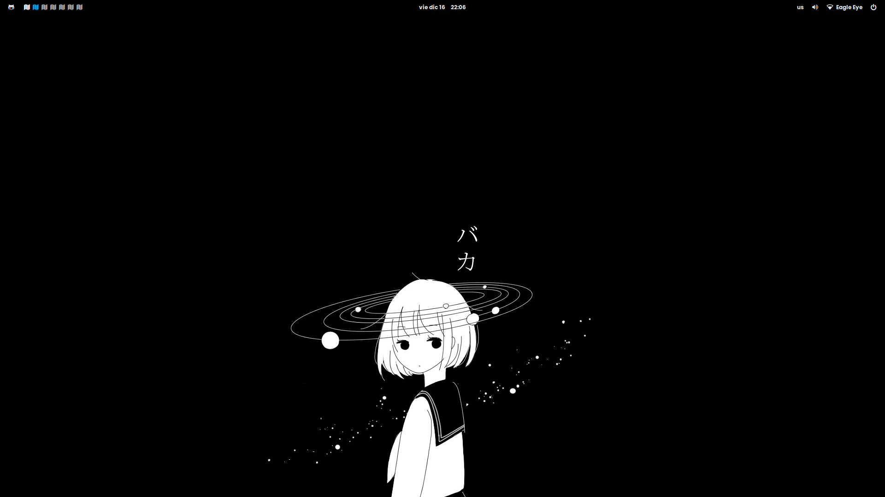
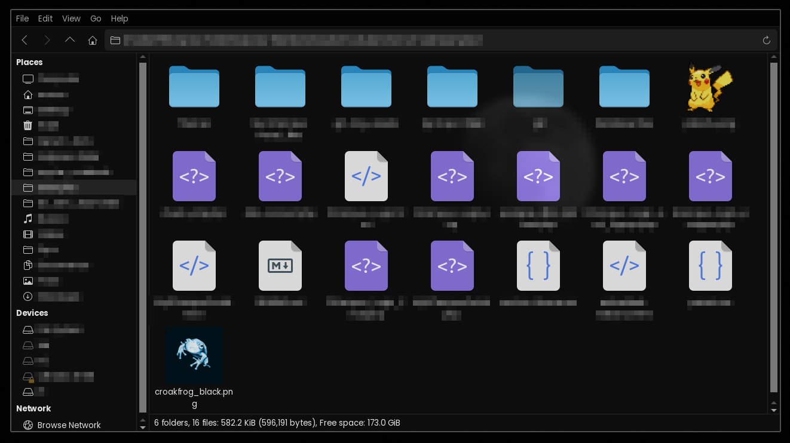

## 📕 <samp>MY DOTFILES REPO</samp>

Hello and welcome to my humble repo. I started ricing just a few months ago and decided that my dotfiles needed a home.

Here's information about my setup:

- **Window Manager:** [bspwm](https://github.com/baskerville/bspwm)
- **Terminal:** [kitty](https://github.com/kovidgoyal/kitty)
- **Shell:** [zsh](https://www.zsh.org/)
- **Panel:** [polybar](https://github.com/polybar/polybar)
- **Compositor:** [picom](https://github.com/yshui/picom)
- **Editor:** [neovim](https://github.com/neovim/neovim)
- **Browser:** [firefox](https://www.mozilla.org/en-US/firefox)
- **Notification Daemon:** [dunst](https://github.com/dunst-project/dunst)
- **File Manager:** [thunar](https://github.com/xfce-mirror/thunar)
- **Application Launcher:** [rofi](https://github.com/davatorium/rofi)

<h2 align="center"> 🌟 <samp>DEMO</samp> </h2>

<p align="center">
  
  
</p>

## 🪛 <samp>INSTALLATION</samp>

Take note that I've only tested installation on Gecko Linux Barebones on a laptop. Only meant for fresh installs, use at your own risk!

```sh
 git clone --recurse-submodules https://github.com/croakFrog/bspwm_dots.git
 cd bspwm_dots
 ./install.sh
```

## 🐧 <samp>MISCELLANEOUS</samp>

- Click for more info on GTK, Cursor Theme, Fonts, Color Scheme
  <details>
    <summary><strong>GTK and Icon Theme</strong></summary>

  > The repo for the <strong>Colloid GTK Theme</strong> can be found [here](https://github.com/vinceliuice/Colloid-gtk-theme). The GTK theme is already installed if you used the install script. You can enable it by using <strong>lxappearance</strong>.

    
    
    > The icon theme I use is just the default blue from [Colloid Icon Theme](https://github.com/vinceliuice/Colloid-icon-theme) and it looks absolutely clean and I love it.
  </details>

  <details>
    <summary><strong>Cursor Theme</strong></summary>

  > Coming soon

  </details>

  <details>
    <summary><strong>Fonts</strong></summary>

  > Coming soon

  </details>

  <details>
    <summary><strong>Color Scheme</strong></summary>

  > Coming soon

  </details>

  <details>
    <summary><strong>Firefox CSS & Startpage</strong></summary>

  > Coming soon

  </details>

## 🙌 <samp>CREDITS</samp>

My dotfiles are inspired by multiple sources <font size=1><i>some just yoinked outright</font></i>, I would like to thank these cool people for inspiring my rice for the following stuff:

- **Adi1090x:** [Polybar](https://github.com/adi1090x/polybar-themes)

- **AstroNvim Devs**: [AstroNvim](https://github.com/AstroNvim/AstroNvim)

- **Andreasgrafen:** [Firefox CSS - Cascade](https://github.com/andreasgrafen/cascade)

- **Chick2D:** [Neofetch](https://github.com/Chick2D/neofetch-themes/)

- **Dcssillag:** [Picom](https://github.com/dccsillag/picom)

- **Janleigh:** [Dunst and NCMPCPP Config](https://github.com/janleigh) <font size=1> also inspired the layout of this repo</font>

- **Molecule47/Fluffy47:** [Firefox Startpage](https://github.com/molecule47/idyllic-firefox)

- **P3rf:** [Rofi-network-manager](https://github.com/P3rf/rofi-network-manager)

- **Romkatv:** [powerlevel10k](https://github.com/romkatv/powerlevel10k)

- **Vinceliuice:** [GTK and Icon Theme](https://github.com/vinceliuice)

If I forgot any, feel free to contact me!
